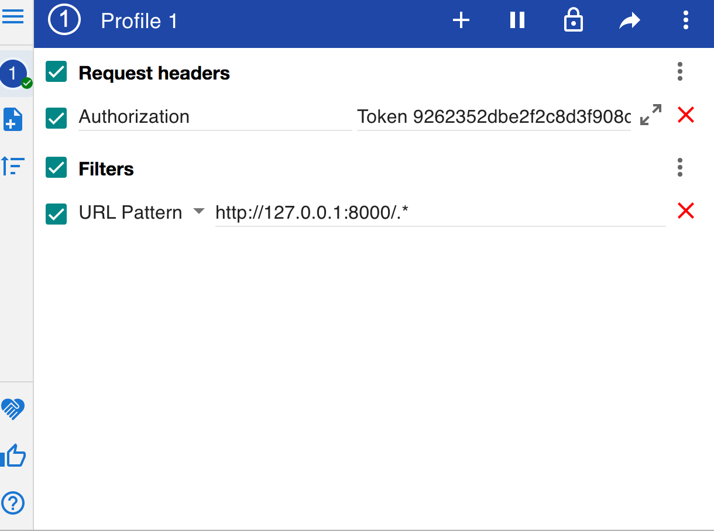

# Django-REST

    + setting up dev environment :

    1- virtualenv venv --python=python3.7
    2- source ./venv/bin/activate

    + create Django project :

    3- mkdir src && cd src
    4- django-admin startproject django_project

    + generate django project :

    5- cd django_project
    6- python manage.py startapp django_restapi

    + enable restframework :

    8- go to settings.py -> INSTALLED_APPS -> add
       'rest_framework',
       'rest_framework.authtoken'
        'django_restapi'

    + run django app :
    - if you had a problem with import rest_framework run ->  pip3 install djangorestframework
    - python manage.py migrate
    9- python manage.py runserver

    + set our Custom Model for Auth in settings.py :

    - after creating UserProfile and UserProfileManager in models.py i should config the Auth settings in settings.py
    - add this line in the end of settings.py -> AUTH_USER_MODEL = 'django_restapi.UserProfile'

    - make a migration
    + python manage.py makemigrations
    django_restapi/migrations/0001_initial.py

    + python manage.py migrate
    ! if you had a problem with migration delete db.sqlite3

    - Django Admin Panel
    + create a superuser :

    1- python manage.py createsuperuser
    2- go to admin.py add :
        from . import models
        admin.site.register(models.UserProfile)

    3- python manage.py runserver
       check localhost:8080/admin

    APIView allow us to define functions that match standard HTTP methods like GET,POST,PUT,PATCH,etc.
    Viewsets allow us to define functions that match to common API object actions like :LIST, CREATE, RETRIEVE, UPDATE, etc.

    Vieewsets are also used to write logic to perform standard database operations and to interface with a database back-end.And are usually used for existing database model to manage predefined objects
        "token": "9262352dbe2f2c8d3f908da5c6034499a6ed6fbc"

    + To Test Authorization :

    1- we built an ViewSet for login, defined create/Post operation and made it return a token for a Login Email/Password.
    2- run django server, go to /api/login enter infos and click post you will got a token save it.
    3- go to chrome extensions download mod header, add this two headers :

    4- go to /api/profile/1
     -> now you can update the field not like before now you have a valid permissions.

    - we create a new model called ProfileFeedItem
    ++ now we should run a migration

    $ python manage.py makemigrations
    $ python manage.py migrate
